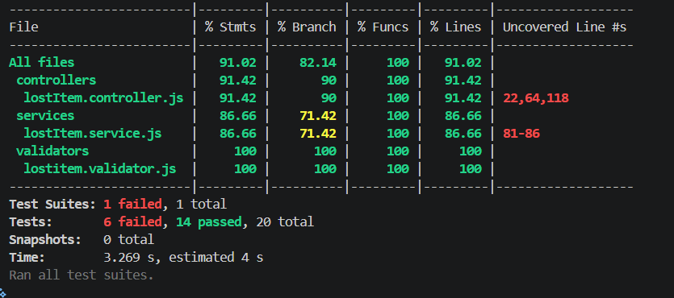
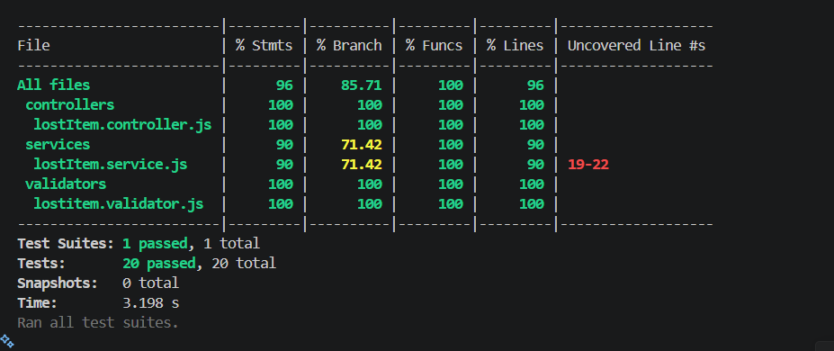

# FINDORA Backend Service

/badge.svg)

## 📊 Skenario Menghapus satu rule di lost item validator

Berikut hasilnya dengan menghapus rule untuk attribute name:

## 📊 Laporan Code Coverage

Berikut adalah hasil ringkasan pengujian unit dan regresi menggunakan Jest & Supertest:

